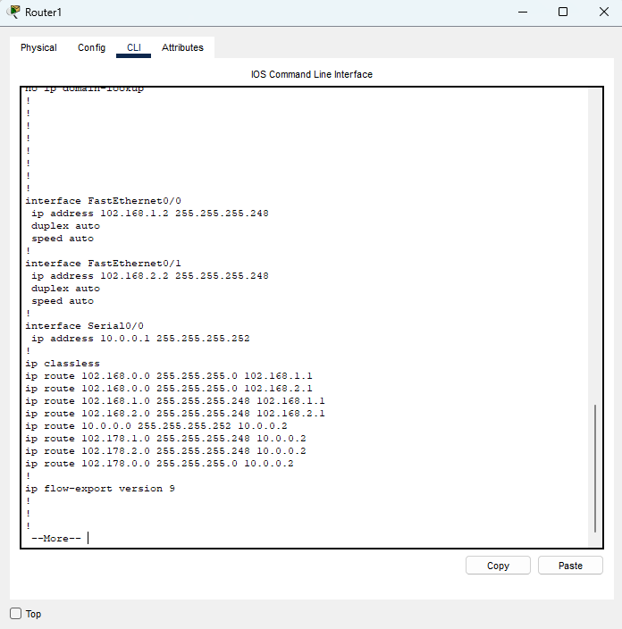
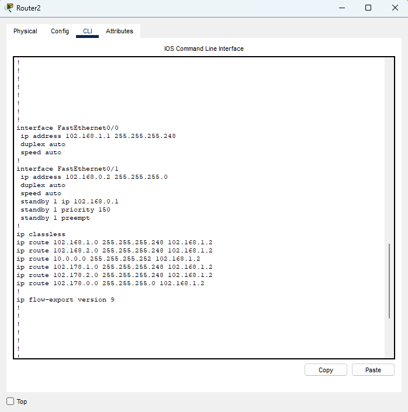
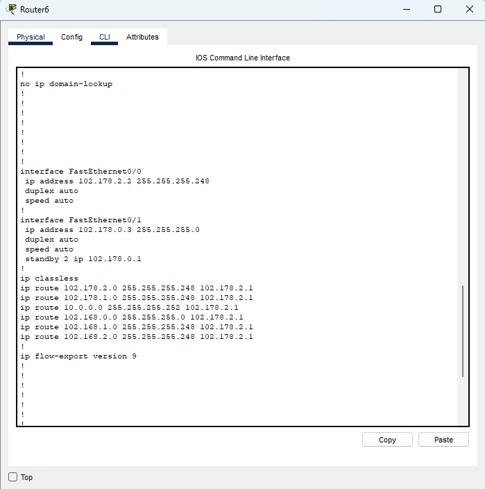
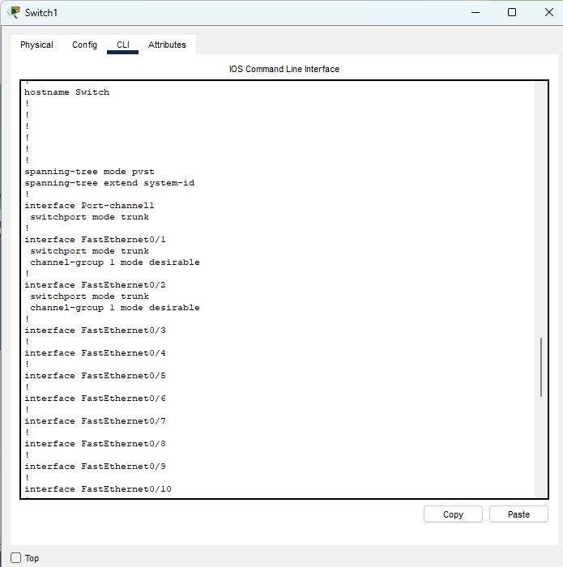
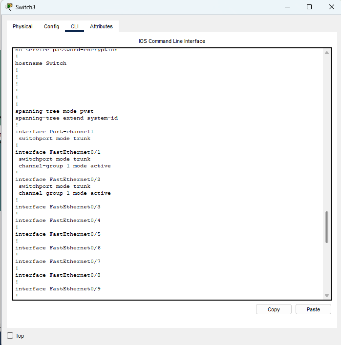
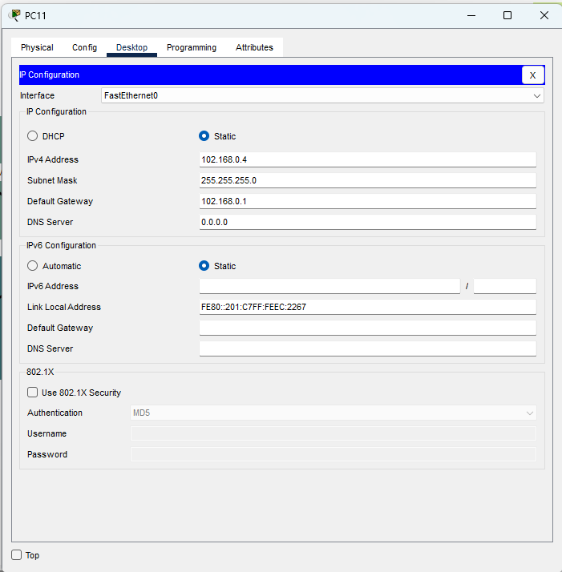
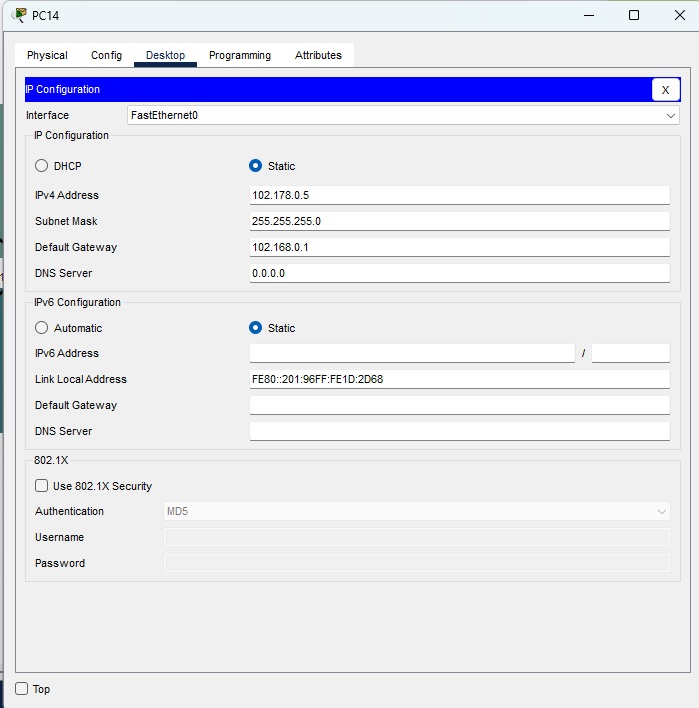

# **Práctica 2 - Redes 1**

## Configuración de Routers

* R1

    

* R2

    

* R6

    

## Configuración de Switches

* SW1

    

* SW3

    

## Configuración de VPC

* VPC11

    

* VPC14

    

| **Tarea**                                      | **Comandos Utilizados**                                                                                                                                   |
|------------------------------------------------|----------------------------------------------------------------------------------------------------------------------------------------------------------|
| **Creación de Ruta Estática**                  | `ip route <network> <subnet mask> <next-hop>`   Ejemplo: `ip route 102.168.0.0 255.255.255.0 102.168.1.1`                                               |
| **Creación de PortChannel con PAGP**           | - `interface range <interfaces>`   - `channel-group <number> mode desirable`   - `interface port-channel <number> switchport mode trunk`             |
| **Creación de PortChannel con LACP**           | - `interface range <interfaces>`   - `channel-group <number> mode active`   - `interface port-channel <number> switchport mode trunk`                |
| **Creación de IP Virtual con HSRP**            | - `standby <group> ip <virtual ip>`   - `standby <group> priority <priority>`   - `standby <group> preempt`   Ejemplo: `standby 1 ip 102.168.0.1` |
| **Configuración de VPC**                       | - `ip route <network> <subnet mask> <next-hop>`   Ejemplo: `ip route 10.0.0.0 255.255.255.252 10.0.0.2`                                                 |

| **Verificación de Funcionamiento**             | **Comandos de Verificación**                                                                                                                              |
|------------------------------------------------|----------------------------------------------------------------------------------------------------------------------------------------------------------|
| **Verificar rutas estáticas**                  | `show ip route`                                                                                                                                           |
| **Verificar estado de PortChannel con PAGP**   | `show etherchannel summary`   `show etherchannel port-channel`                                                                                          |
| **Verificar estado de PortChannel con LACP**   | `show etherchannel summary`   `show etherchannel port-channel`                                                                                          |
| **Verificar estado de HSRP**                   | `show standby brief`                                                                                                                                      |
| **Verificar conectividad VPC**                 | `ping -t <IP destino>`                                                                                                                                       |
